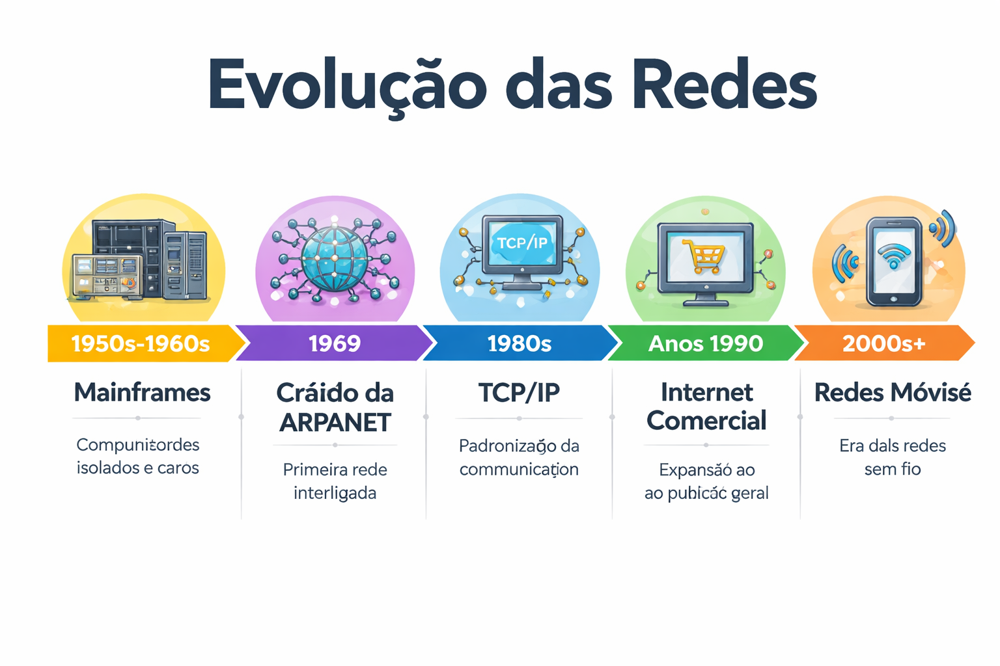

# Aula 10 – Redes de Computadores: Histórico, Elementos e Classificação

## Nome(s) dos estudante(s): Arthur Santos Lemos Reis
## Matrícula(s): 22601342 
---

## Objetivos da Aula

- **Compreender a evolução das redes de computadores.**
- **Identificar os elementos básicos de uma rede.**
- **Classificar redes segundo abrangência geográfica e modelo computacional.**

### 1. **Linha do Tempo**

### 2. **Elementos da Rede**

**Os quatro elementos são**:
- **Emissor**: O dispositivo que transmite a informação inicial. 
- **Receptor**: O dispositivo que recebe a informação.
- **Meio de Transmissão**: O caminho pelo qual os dados são transmitidos.
- **Protocolo**: O conjunto de regras que define como a comunicação ocorre e é compreendida.

**Sugestão para imagem**: Faça um diagrama simples ilustrando os quatro elementos conectados. Utilize **setas** para mostrar o fluxo de dados entre eles. Isso pode ser feito no **Canva** ou **Google Slides**.

### 3. **Classificação de Redes**
Com base na **classificação geográfica** e **modelo computacional** apresentada no PDF, cada grupo deverá criar um quadro comparativo com exemplos de redes de diferentes categorias.

**Classificação Geográfica**:
- **PAN (Personal Area Network)**: Rede de dispositivos próximos (exemplo: Bluetooth entre celular e fone de ouvido).
- **LAN (Local Area Network)**: Rede local (exemplo: rede doméstica ou de laboratório).
- **MAN (Metropolitan Area Network)**: Rede que abrange uma cidade (exemplo: rede de uma universidade ou prefeitura).
- **WAN (Wide Area Network)**: Rede de larga distância (exemplo: a própria Internet).

**Classificação de Modelos Computacionais**:
- **Computação Centralizada**: Um único computador centraliza os recursos e fornece serviços aos dispositivos conectados (exemplo: mainframes).
- **Cliente/Servidor**: Dispositivos clientes acessam recursos fornecidos por um servidor centralizado.
- **Ponto-a-Ponto (P2P)**: Todos os dispositivos têm o mesmo papel, compartilhando recursos diretamente entre si (exemplo: torrent).

**Sugestão para imagem**: Utilize uma tabela ou **mapa conceitual** que organize essas classificações de forma clara. Pode ser feito com o **Google Slides**, **Canva** ou **PowerPoint**.

---

## Organização dos Arquivos

1. Crie uma pasta com o nome do seu grupo (exemplo: `Grupo1_Windows`, `Grupo2_Linux`).
2. Dentro da pasta, organize os seguintes arquivos:
   - `linha_tempo.pdf` ou `linha_tempo.png` (Imagem ou PDF com a linha do tempo ilustrada).
   - `elementos_rede.png` ou `elementos_rede.pdf` (Esquema representando os quatro elementos da rede).
   - `classificacao_redes.pdf` ou `classificacao_redes.png` (Quadro comparativo das redes).
   - `README.md` (Este arquivo, com a breve descrição do trabalho).

---

## Instruções Adicionais

- As imagens devem ser claras e bem organizadas, para garantir que todos os conceitos sejam entendidos com facilidade.
- As apresentações orais devem ser realizadas durante a aula, com uma explicação breve de cada artefato.
- Publique todos os arquivos na pasta correspondente dentro do repositório GitHub da disciplina.
- Utilize uma ferramenta digital (Google Slides, Canva, PowerPoint, etc.) para criar os artefatos visuais.

---

## Reflexão Individual (para casa)

Após a aula, escreva uma reflexão de 1 página sobre como a evolução das redes de computadores influenciou a sociedade atual, com base nas discussões da aula.

---

## **Referências**:

- **TANENBAUM, Andrew S.** *Redes de Computadores* (6ª Edição). Pearson/Bookman.
- **SOARES, L.; LEMOS, G.; COLCHER, S.** *Redes de Computadores: Das LANs, MANs e WANs às Redes ATM*. Editora Campus.
- **Amazon Web Services (AWS).** O que são redes de computadores?
- TMJuntos. Linha do tempo da evolução da tecnologia. Disponível em: <https://tmjuntos.com.br/tecnologia/linha-do-tempo-da-evolucao-da-tecnologia/>.

