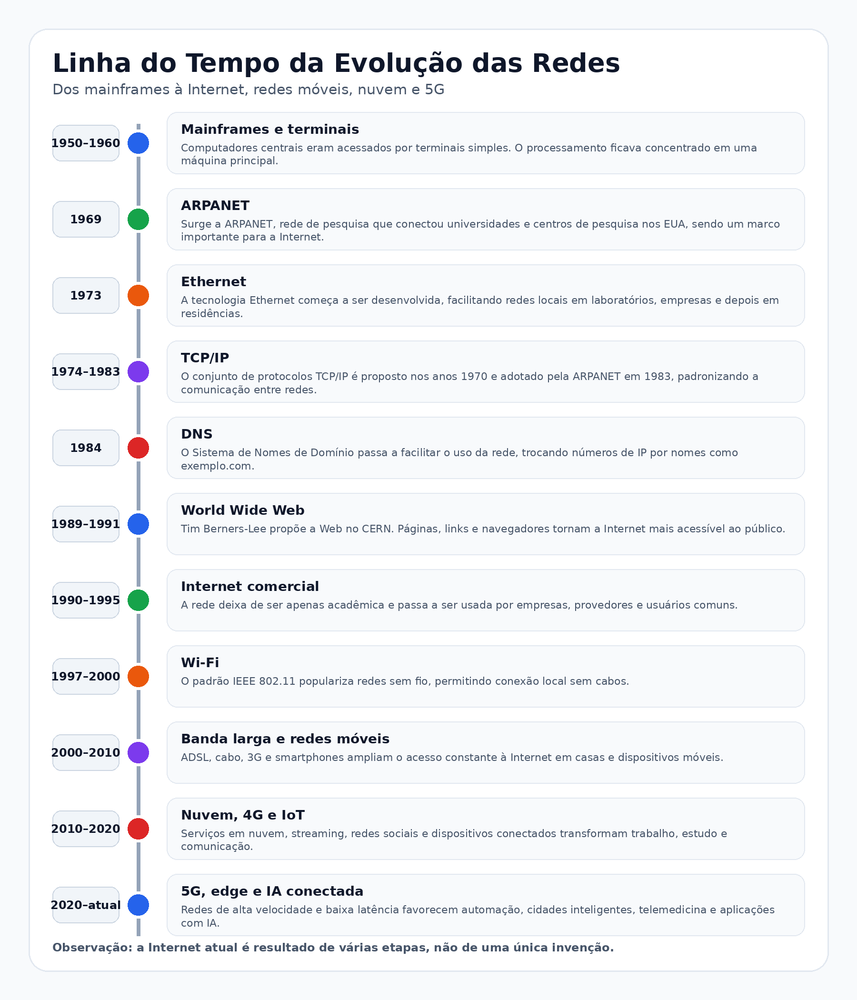
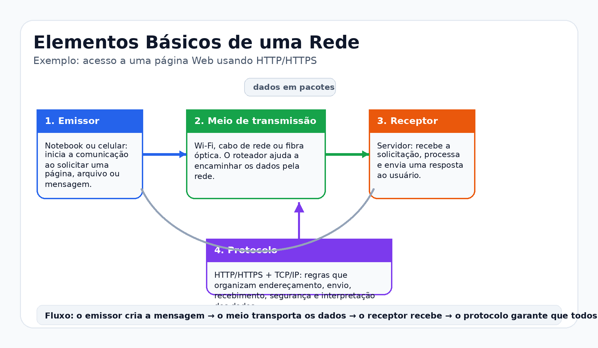
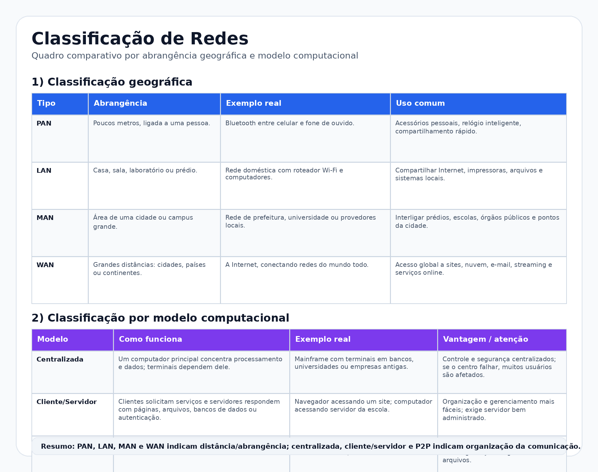

# Aula 10 – Redes de Computadores: Histórico, Elementos e Classificação

## Nome(s) dos estudante(s): Arthur Santos Lemos Reis  
## Matrícula(s): 22601342  

---

## Objetivos da Aula

- Compreender a evolução das redes de computadores.
- Identificar os elementos básicos de uma rede.
- Classificar redes segundo abrangência geográfica e modelo computacional.
- Relacionar os conceitos de redes com exemplos do cotidiano.

---

## 1. Linha do Tempo da Evolução das Redes

A evolução das redes de computadores não aconteceu de uma vez. Ela começou com computadores centrais e terminais, passou por redes acadêmicas como a ARPANET, ganhou padronização com o TCP/IP e se popularizou com a Internet comercial, a Web, o Wi‑Fi, as redes móveis e os serviços em nuvem.



### Principais marcos

| Período/Ano | Marco | Explicação |
|---|---|---|
| 1950–1960 | Mainframes e terminais | Computadores centrais eram acessados por terminais simples. O processamento ficava concentrado em uma máquina principal. |
| 1969 | ARPANET | Rede de pesquisa que conectou universidades e centros de pesquisa nos EUA. É considerada um marco importante na história da Internet. |
| 1973 | Ethernet | Tecnologia criada para facilitar a comunicação em redes locais, muito usada depois em empresas, escolas e residências. |
| 1974–1983 | TCP/IP | Conjunto de protocolos que padronizou a comunicação entre redes diferentes. Em 1983, passou a ser adotado na ARPANET. |
| 1984 | DNS | Sistema que permite usar nomes de domínio em vez de decorar endereços numéricos de IP. |
| 1989–1991 | World Wide Web | A Web tornou a Internet mais acessível por meio de páginas, links e navegadores. |
| 1990–1995 | Internet comercial | A Internet começou a se expandir para empresas, provedores e usuários comuns. |
| 1997–2000 | Wi‑Fi | A conexão sem fio passou a facilitar o acesso em casas, escolas, empresas e espaços públicos. |
| 2000–2010 | Banda larga e redes móveis | A Internet ficou mais rápida e acessível, principalmente com banda larga, 3G e smartphones. |
| 2010–2020 | Nuvem, 4G e IoT | Serviços online, armazenamento em nuvem, streaming, redes sociais e dispositivos conectados se tornaram comuns. |
| 2020–atual | 5G, edge computing e IA conectada | Redes mais rápidas e de baixa latência favorecem automação, cidades inteligentes, telemedicina e aplicações com inteligência artificial. |

---

## 2. Elementos Básicos de uma Rede

Uma rede de computadores permite que dispositivos troquem informações. Para isso acontecer, quatro elementos básicos estão presentes: emissor, receptor, meio de transmissão e protocolo.



### Quatro elementos da rede

| Elemento | Definição | Exemplo real |
|---|---|---|
| Emissor | Dispositivo que inicia o envio da informação. | Notebook, celular ou computador solicitando acesso a um site. |
| Receptor | Dispositivo que recebe a informação ou a solicitação. | Servidor que recebe o pedido e responde com uma página, arquivo ou serviço. |
| Meio de transmissão | Caminho usado para transportar os dados. | Cabo de rede, fibra óptica, ondas de rádio do Wi‑Fi ou sinal móvel. |
| Protocolo | Conjunto de regras que organiza como a comunicação deve acontecer. | HTTP/HTTPS para páginas Web e TCP/IP para endereçamento e transporte de dados. |

### Exemplo prático

Quando uma pessoa abre um site no celular, o **celular** funciona como emissor, pois envia a solicitação. Os dados passam pelo **Wi‑Fi, cabos, fibra óptica e roteadores**, que ajudam a transportar e encaminhar a informação. O **servidor do site** funciona como receptor da solicitação e depois envia uma resposta. O processo só funciona porque existem **protocolos**, como TCP/IP e HTTP/HTTPS, que definem as regras para o envio, recebimento e interpretação dos dados.

Observação técnica: o roteador não é exatamente o “meio de transmissão”; ele é um equipamento de rede que encaminha os dados. O meio de transmissão é o caminho físico ou sem fio, como cabo, fibra ou Wi‑Fi.

---

## 3. Classificação de Redes

As redes podem ser classificadas de acordo com a abrangência geográfica e também pelo modelo computacional utilizado.



### 3.1 Classificação geográfica

| Tipo de rede | Significado | Abrangência | Exemplo real | Uso comum |
|---|---|---|---|---|
| PAN | Personal Area Network | Poucos metros, ligada a uma pessoa. | Bluetooth entre celular e fone de ouvido. | Conectar dispositivos pessoais, como relógio inteligente, fone e celular. |
| LAN | Local Area Network | Casa, sala, laboratório, escola ou prédio. | Rede doméstica com roteador Wi‑Fi. | Compartilhar Internet, arquivos, impressoras e sistemas locais. |
| MAN | Metropolitan Area Network | Área de uma cidade ou campus grande. | Rede de uma universidade, prefeitura ou provedor local. | Interligar prédios, órgãos públicos, escolas e unidades de uma mesma cidade. |
| WAN | Wide Area Network | Grandes distâncias, como cidades, países e continentes. | A própria Internet. | Comunicação global, acesso a sites, nuvem, e‑mail e serviços online. |

### 3.2 Classificação por modelo computacional

| Modelo | Como funciona | Exemplo real | Vantagem / ponto de atenção |
|---|---|---|---|
| Computação centralizada | Um computador principal concentra processamento, dados e serviços. Os terminais dependem dele. | Mainframes usados por bancos, universidades ou grandes empresas. | Facilita controle e administração, mas cria dependência do computador central. |
| Cliente/Servidor | Clientes solicitam serviços e servidores respondem. | Navegador acessando um site; computador acessando servidor da escola. | É organizado e muito usado na Web, mas exige servidores bem configurados e seguros. |
| Ponto a Ponto (P2P) | Os dispositivos podem atuar como cliente e servidor, compartilhando recursos diretamente. | Compartilhamento via torrent ou envio direto entre computadores. | Distribui a carga entre os participantes, mas exige cuidado com segurança e confiabilidade dos arquivos. |

### Comparação geral

| Critério | PAN | LAN | MAN | WAN |
|---|---|---|---|---|
| Alcance | Muito curto | Local | Municipal/metropolitano | Longa distância |
| Custo de implantação | Baixo | Baixo a médio | Médio a alto | Alto |
| Velocidade típica | Média | Alta | Alta | Variável |
| Exemplo | Bluetooth | Rede de laboratório | Rede de prefeitura | Internet |
| Principal objetivo | Conectar dispositivos pessoais | Conectar dispositivos de um mesmo local | Conectar pontos de uma cidade | Conectar redes distantes |

---

## 4. Síntese e Fechamento

A evolução das redes mostra como a comunicação digital saiu de ambientes restritos, como grandes centros de pesquisa e empresas, para chegar ao uso cotidiano. Hoje, redes estão presentes em celulares, computadores, caixas eletrônicos, escolas, hospitais, sistemas de transporte, plataformas de estudo, redes sociais e serviços de streaming.

A principal diferença entre PAN, LAN, MAN e WAN está na **abrangência**. Já os modelos centralizado, cliente/servidor e P2P mostram **como os computadores se organizam para compartilhar recursos**. Entender essas classificações ajuda a compreender melhor como a Internet funciona e por que ela é tão importante para a vida pessoal e profissional.

---

## 5. Organização dos Arquivos para o GitHub

A pasta do trabalho deve ser organizada da seguinte forma:

```text
Arthur_Redes_Aula10/
├── README.md
└── imagens/
    ├── linha_do_tempo.png
    ├── elementos_rede.png
    └── classificacao_redes.png
```

### Arquivos entregues

- `README.md`: descrição completa do trabalho, objetivos, explicações, tabelas e reflexão.
- `imagens/linha_do_tempo.png`: linha do tempo ilustrada com os principais marcos da evolução das redes.
- `imagens/elementos_rede.png`: esquema visual dos quatro elementos básicos de uma rede.
- `imagens/classificacao_redes.png`: quadro comparativo das redes por abrangência geográfica e modelo computacional.

---

## 6. Participação no Grupo

Como o arquivo informa apenas um estudante, a organização foi registrada de forma individual.

| Estudante | Participação registrada |
|---|---|
| Arthur Santos Lemos Reis | Organização do README, pesquisa dos conceitos, estruturação da linha do tempo, explicação dos elementos da rede, criação do quadro comparativo e escrita da reflexão individual. |

---

## 7. Reflexão Individual

A evolução das redes de computadores influenciou profundamente a sociedade atual. Antes, o uso dos computadores era restrito a grandes empresas, universidades e centros de pesquisa, principalmente por causa do tamanho, do custo e da complexidade dos equipamentos. Com o passar do tempo, as redes permitiram que computadores diferentes se comunicassem, compartilhassem informações e acessassem serviços à distância. Isso mudou a forma como as pessoas estudam, trabalham, compram, se comunicam e participam da vida social.

Um dos maiores impactos foi na comunicação. Hoje é possível enviar mensagens instantâneas, fazer chamadas de vídeo, participar de aulas online e trabalhar com pessoas que estão em outras cidades ou países. Esse avanço aproximou pessoas e tornou muitos processos mais rápidos. A Internet também facilitou o acesso ao conhecimento, pois livros, vídeos, cursos, pesquisas e notícias podem ser acessados de forma muito mais simples do que no passado.

No mundo profissional, as redes criaram novas formas de trabalho. Empresas usam sistemas online, armazenamento em nuvem, reuniões virtuais, comércio eletrônico e atendimento digital. Muitas profissões surgiram ou foram transformadas por causa da conectividade, como desenvolvimento de sistemas, segurança da informação, marketing digital, suporte técnico, análise de dados e criação de conteúdo. Isso mostra que as redes não são apenas uma tecnologia de apoio, mas uma base importante para a economia atual.

Na educação, as redes permitiram o uso de ambientes virtuais, plataformas de atividades, bibliotecas digitais e aulas remotas. Mesmo assim, também ficou claro que nem todas as pessoas têm o mesmo acesso à Internet de qualidade. Por isso, a evolução das redes trouxe benefícios, mas também reforçou a importância de discutir inclusão digital.

Também existem desafios. Quanto mais conectada a sociedade fica, maiores são as preocupações com privacidade, segurança, golpes virtuais, vazamento de dados, fake news e dependência da tecnologia. Assim, além de saber usar a Internet, é importante compreender como ela funciona e como utilizá-la de maneira crítica e responsável.

Portanto, a evolução das redes de computadores transformou a sociedade porque conectou pessoas, informações, empresas e serviços. Ela tornou o mundo mais rápido e integrado, mas também trouxe responsabilidades. Entender redes é importante para usar melhor a tecnologia, proteger informações e participar de forma consciente da sociedade digital.

---

## 8. Referências

- TANENBAUM, Andrew S.; WETHERALL, David J. *Redes de Computadores*. 6. ed. Pearson/Bookman.
- SOARES, Luiz Fernando Gomes; LEMOS, Guido; COLCHER, Sérgio. *Redes de Computadores: Das LANs, MANs e WANs às Redes ATM*. Editora Campus.
- KUROSE, James F.; ROSS, Keith W. *Redes de Computadores e a Internet: Uma Abordagem Top-Down*. Pearson.
- Amazon Web Services (AWS). *O que são redes de computadores?*
- Internet Society. *Brief History of the Internet*.
- W3C. *A Little History of the World Wide Web*.
- IEEE. *802.11 Wireless Local Area Networks*.

