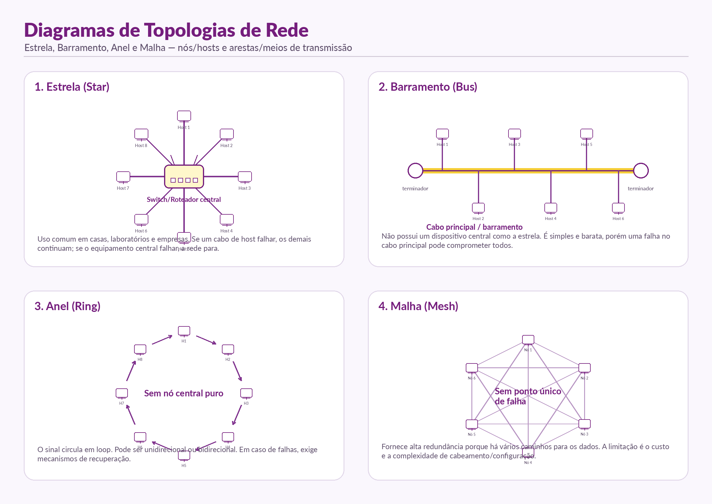
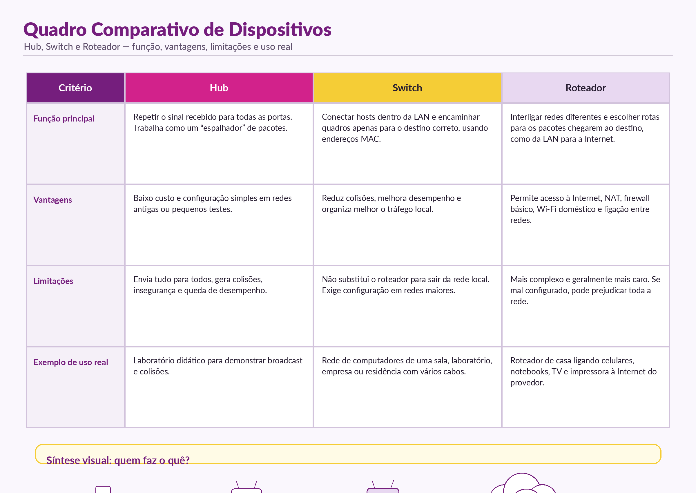
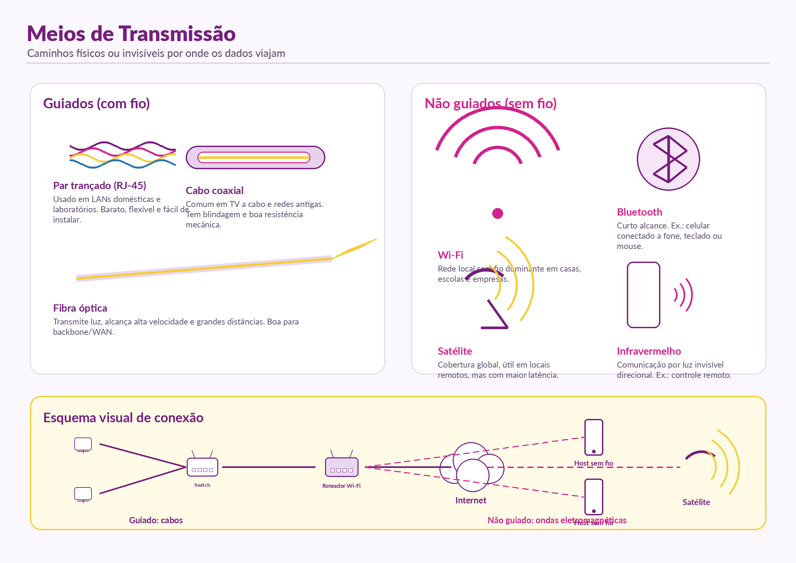

# Aula 11 – Redes de Computadores: Topologias, Dispositivos e Meios

## Nome(s) dos estudante(s): Arthur Santos Lemos Reis
## Matrícula(s): 22601342

---

## Objetivo da Aula

Entender a organização física e lógica das redes, identificar os principais dispositivos de rede e reconhecer os diferentes meios de transmissão usados para transportar dados.

---

## 1. Diagramas de Topologias

A topologia de rede representa a forma como os nós, também chamados de hosts ou equipamentos, são organizados e conectados pelos meios de transmissão. Ela pode ser entendida de duas maneiras:

- **Topologia física:** mostra como os cabos, equipamentos e conexões estão distribuídos no espaço.
- **Topologia lógica:** mostra como os dados circulam entre os dispositivos, mesmo que a organização física seja diferente.

### Estrela (Star)

Na topologia em estrela, todos os hosts se conectam a um equipamento central, geralmente um **switch**, **hub** ou **roteador**. É o modelo mais comum em redes modernas, principalmente em residências, laboratórios e empresas.

**Vantagens:**
- Fácil de instalar e organizar.
- A falha em um cabo de um host não derruba a rede inteira.
- Facilita a manutenção e a expansão da rede.

**Limitações:**
- Se o equipamento central falhar, toda a rede pode ser prejudicada.
- Pode exigir mais cabos do que o barramento.

**Exemplo real:** rede doméstica com roteador Wi‑Fi no centro conectando notebooks, celulares, TV e impressora.

### Barramento (Bus)

Na topologia em barramento, os hosts ficam ligados a um **cabo principal**, que funciona como o caminho comum dos dados. Em uma rede bus pura, não existe um dispositivo central como na estrela.

**Vantagens:**
- Estrutura simples.
- Pode usar menos cabo em redes pequenas e antigas.

**Limitações:**
- Se o cabo principal falhar, vários dispositivos podem ficar sem comunicação.
- Pode haver colisões e queda de desempenho.
- É uma arquitetura mais antiga e pouco usada atualmente.

**Exemplo real:** redes antigas com cabo coaxial compartilhado.

### Anel (Ring)

Na topologia em anel, cada host se conecta ao próximo, formando um circuito fechado. O sinal circula em loop, podendo seguir em um sentido ou nos dois sentidos, dependendo da tecnologia.

**Vantagens:**
- Organização previsível do tráfego.
- Cada nó participa da passagem dos dados.

**Limitações:**
- Uma falha pode afetar a circulação dos dados se não houver redundância.
- A manutenção pode ser mais complexa.

**Exemplo real:** tecnologias antigas de redes em anel, como Token Ring.

### Malha (Mesh)

Na topologia em malha, os nós possuem múltiplas conexões entre si. Em uma malha completa, todos se conectam com todos; em uma malha parcial, existem vários caminhos alternativos, mas nem todos os nós estão ligados diretamente.

**Vantagens:**
- Alta redundância.
- Se um caminho falhar, os dados podem seguir por outro.
- Boa tolerância a falhas.

**Limitações:**
- Custo mais alto.
- Maior complexidade de cabeamento e configuração.

**Exemplo real:** redes corporativas críticas, backbone de provedores e redes mesh Wi‑Fi residenciais com vários pontos de acesso.

---

## 2. Quadro Comparativo de Dispositivos

Os dispositivos de rede podem ser divididos em **finais**, que geram ou consomem informação, e **intermediários**, que encaminham, organizam ou controlam o tráfego. Exemplos de dispositivos finais são notebook, celular, impressora e servidor. Exemplos de intermediários são hub, switch e roteador.

| Critério | Hub | Switch | Roteador |
|---|---|---|---|
| **Função principal** | Repete o sinal recebido para todas as portas. | Encaminha os dados apenas para o destino correto dentro da LAN, usando endereços MAC. | Interliga redes diferentes e escolhe rotas para os pacotes chegarem ao destino. |
| **Vantagens** | Simples e barato para demonstrações ou redes antigas. | Reduz colisões, melhora o desempenho e deixa a comunicação mais organizada. | Liga a rede local à Internet, pode oferecer NAT, firewall básico, Wi‑Fi e gerenciamento de rotas. |
| **Limitações** | Envia tudo para todos, causa colisões e reduz a eficiência. | Não substitui o roteador para acesso entre redes diferentes. | Mais complexo e depende de configuração correta. |
| **Exemplo de uso real** | Laboratório para demonstrar broadcast e colisões. | Rede cabeada de laboratório, escritório ou residência. | Roteador doméstico conectando celulares, notebooks, TV e impressora à Internet. |

### Diferença principal entre Hub e Switch

O **hub** é como um repetidor coletivo: quando recebe um dado, espalha para todos os dispositivos conectados. Isso pode gerar tráfego desnecessário e colisões. O **switch** é mais inteligente: aprende os endereços dos dispositivos e envia o dado apenas para a porta correta.

### Papel do Roteador

O **roteador** conecta redes diferentes. Em uma residência, ele liga a rede local da casa à rede do provedor de Internet. Por isso, ele pode ser entendido como um “conector de mundos” e também como um “GPS de dados”, pois ajuda a escolher o caminho dos pacotes.

---

## 3. Meios de Transmissão

Os meios de transmissão são os caminhos por onde os dados viajam. Eles podem ser divididos em **guiados**, quando o sinal passa por um meio físico, e **não guiados**, quando o sinal se propaga pelo espaço por ondas eletromagnéticas.

### 3.1 Meios Guiados (com fio)

| Meio | Característica | Exemplo de uso |
|---|---|---|
| **Par trançado** | Cabo com pares de fios entrelaçados, comum em redes Ethernet. | Cabo de rede RJ‑45 em casas, laboratórios e empresas. |
| **Cabo coaxial** | Possui blindagem e boa resistência mecânica. | TV a cabo e redes antigas. |
| **Fibra óptica** | Transmite dados por luz, com alta velocidade e grande alcance. | Backbones, provedores de Internet, conexões WAN e links críticos. |

### 3.2 Meios Não Guiados (sem fio)

| Meio | Característica | Exemplo de uso |
|---|---|---|
| **Wi‑Fi** | Usa ondas de rádio para formar redes locais sem fio. | Celulares, notebooks e smart TVs conectados ao roteador. |
| **Bluetooth** | Comunicação de curto alcance. | Celular conectado a fone de ouvido, teclado, mouse ou caixa de som. |
| **Satélite** | Permite comunicação em grandes áreas e locais remotos. | Internet via satélite, transmissão global e comunicação em regiões afastadas. |
| **Infravermelho** | Usa luz invisível direcional. | Controle remoto de TV e alguns sensores. |

### Complemento: Direcionalidade da Comunicação

A comunicação também pode ser classificada pela direção em que os dados trafegam:

- **Simplex:** transmissão em apenas um sentido.
- **Half‑duplex:** transmissão nos dois sentidos, mas não ao mesmo tempo.
- **Full‑duplex:** transmissão simultânea nos dois sentidos.

---

## 4. Exemplo de Rede Residencial

Uma rede residencial comum normalmente usa uma estrutura parecida com a **topologia estrela**. O roteador Wi‑Fi fica no centro da rede e conecta os dispositivos da casa, como celulares, notebooks, smart TV, videogame e impressora.

### Classificação do exemplo

- **Escopo:** LAN/WLAN residencial.
- **Topologia lógica predominante:** estrela, pois os dispositivos dependem do roteador ou ponto de acesso central.
- **Dispositivo intermediário principal:** roteador Wi‑Fi.
- **Meios de transmissão:** Wi‑Fi para dispositivos móveis e cabo Ethernet para equipamentos fixos, quando necessário.
- **Dispositivos finais:** celular, notebook, TV, impressora, videogame e computador.

---

## 5. Reflexão Individual

**Pergunta:** Qual topologia seria mais adequada para a rede da sua residência e por quê?

A topologia mais adequada para uma residência é a **topologia estrela**, principalmente quando usamos um roteador Wi‑Fi como ponto central da rede. Essa topologia é a mais comum em casas porque permite que vários dispositivos, como celulares, notebooks, televisões, videogames e impressoras, se conectem ao mesmo equipamento central de forma simples e organizada.

Em uma rede doméstica, o roteador funciona como o principal dispositivo intermediário. Ele distribui o acesso à Internet, organiza a comunicação entre os aparelhos e permite conexões com fio e sem fio. Os dispositivos móveis geralmente usam Wi‑Fi, enquanto equipamentos que precisam de mais estabilidade, como computadores de mesa, videogames ou smart TVs, podem usar cabo Ethernet.

A principal vantagem da topologia estrela é a facilidade de manutenção. Se um celular ou notebook apresentar problema, os outros dispositivos continuam funcionando normalmente. Além disso, é fácil adicionar novos aparelhos à rede, bastando conectar ao Wi‑Fi ou ao switch/roteador por cabo. Isso torna a rede residencial mais prática e flexível.

A limitação dessa topologia é que ela depende muito do equipamento central. Se o roteador falhar, a maior parte da rede perde acesso à Internet. Mesmo assim, para uma residência, a topologia estrela continua sendo a melhor opção, pois oferece boa organização, baixo custo, facilidade de uso e atende bem às necessidades do dia a dia.

---

## 6. Organização dos Arquivos

A pasta desta atividade contém:

- `topologia.png` — diagramas das topologias estrela, barramento, anel e malha.
- `dispositivos.png` — quadro comparativo entre hub, switch e roteador.
- `meios_transmissao.png` — classificação dos meios guiados e não guiados.
- `README.md` — descrição completa do trabalho.
- `reflexao_individual.md` — texto individual sobre a topologia mais adequada para uma residência.

---

## 7. Critérios Atendidos

- Diagramas claros das principais topologias de rede.
- Identificação dos hosts, dispositivos intermediários e meios de transmissão.
- Comparação entre hub, switch e roteador com função, vantagens, limitações e exemplo real.
- Classificação dos meios de transmissão em guiados e não guiados.
- Reflexão individual respondendo à pergunta solicitada.
- Referência bibliográfica indicada no enunciado.

---

## ReferênciaReferencias

- TANENBAUM, A. S.; FEAMSTER, N.; WETHERALL, D. J. **Redes de computadores**. 6. ed. São Paulo: Bookman, 2021.
- Material da Aula 11: **Fundamentos de Redes: Topologias, Dispositivos e Meios**.

